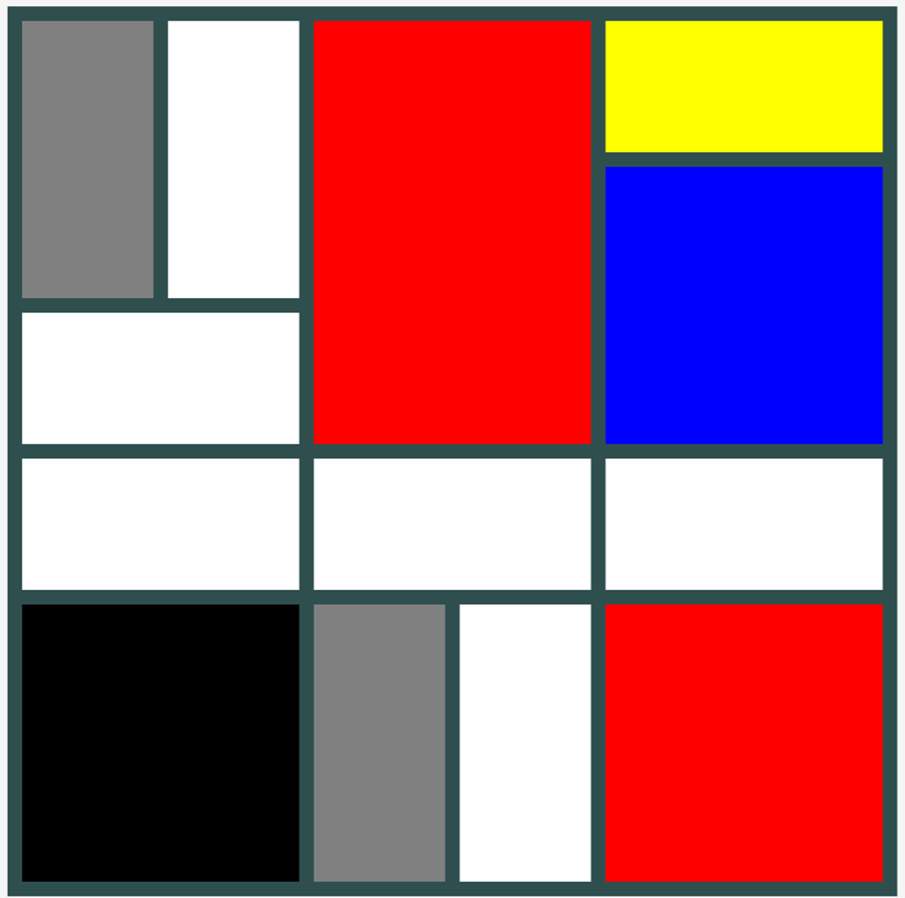

# Oefenreeks 04 - Positioneren van elementen
## Oefening A
### OPGAVE/ STAPPEN

* Maak een nieuwe folder aan waar je in zal werken.
* Voorzie in deze folder een map genaamd css
* Maak een pagina aan index.html op een passende plaats in je folder structuur en voorzie volgende:
  * De titel van de pagina is “Mondriaan” 
  * Maak door middel van div elementen, *en enkel div elementen*, onderstaande figuur na.
* Denk na over hoe je je css zal gebruiken om je hierin te assisteren.

#### Screenshot na te maken:

 